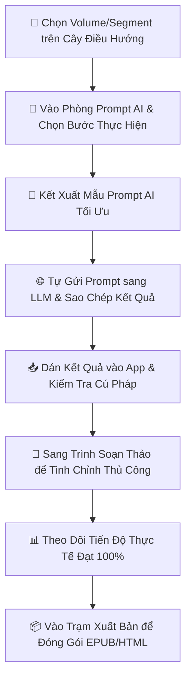

# ⚡ MANUAL STUDIO v3 - BUỒNG LÁI DỊCH THUẬT LIGHT NOVEL / WEB NOVEL

```text
    __  ___                               __   _____ __             ___               _____
   /  |/  /___ _____  __  ___________ _  / /  / ___// /___  ______ _/ (_)___     _    |__  /
  / /|_/ / __ `/ __ \/ / / / __ `/ __ `/ / /   \__ \/ __/ / / / __ `/ / / __ \  (_)    /_ < 
 / /  / / /_/ / / / / /_/ / /_/ / /_/ / / /   ___/ / /_/ /_/ / /_/ / / / /_/ /   _    ___/ / 
/_/  /_/\__,_/_/ /_/\__,_/\__,_/\__,_/_/_/   /____/\__/\__,_/\__,_/_/_/\____/   (_)  /____/  
                                                                                            
                     [ BUỒNG LÁI DỊCH THUẬT TOÀN DIỆN CHO WIBU ĐÍCH THỰC ]
```

**Manual Studio v3** là một studio dịch truyện theo mô hình **manual-in-the-loop** (con người kiểm soát quy trình) dành cho dịch giả và editor Light Novel / Web Novel chuyên nghiệp. 

Không giống như các công cụ dịch thuật tự động một nút bấm (One-click) cẩu thả, công cụ này được thiết kế để giải quyết đúng những bài toán nhức nhối nhất của truyện dài tập: **trôi thuật ngữ (glossary), loạn xưng hô, sai lệch mối quan hệ nhân vật, gán nhãn hội thoại lộn xộn, tên riêng thiếu nhất quán, chất lượng kiểm soát (QA) hời hợt, và thành phẩm xuất bản bị mất dấu vết.**

> [!WARNING]
> **ĐÂY KHÔNG PHẢI CÔNG CỤ DỊCH TỰ ĐỘNG KHÔNG NÃO.** 
> Dự án này không tự gọi API hộ bạn để "phung phí" token hay freestyle bản dịch bừa bãi. Công cụ sẽ dựng cấu trúc dữ liệu JSON sạch, kết xuất (render) Prompt mẫu tối ưu để bạn tự gửi sang bất kỳ LLM nào bạn thích (Claude, GPT, Gemini), kiểm tra cú pháp phản hồi, và nạp ngược lại hệ thống một cách có tổ chức.

---

## 🧭 Các Trụ Cột Trong Buồng Lái

Giao diện chính được xây dựng bằng **PyQt6** với thiết kế màu đêm tối Cyberpunk tuyệt đẹp, giảm mỏi mắt khi dịch giả làm việc lúc 2 giờ sáng.

### 1. Cây Điều Hướng Cấp Độ (Navigation Panel)
Cây điều hướng lề trái là xương sống của mọi thao tác và điều khiển ngữ cảnh (Context) của toàn bộ ứng dụng:
- **📖 Tập (Volume)**: Mở các bước chẩn đoán và quản lý ở phạm vi toàn tập.
- **📜 Chương (Chapter)**: Trích xuất thuật ngữ và nhân vật ở phạm vi chương.
- **🔸 Phân đoạn (Segment)**: Điều chỉnh chi tiết nhất từ tạo Prompt, Soạn thảo, Dịch, QA cho đến Sửa lỗi.

### 2. 🤖 Phòng Prompt AI
- Chọn bước dịch thuật hiện tại trong quy trình.
- Tạo mẫu Prompt AI, tự động tích hợp bối cảnh, thuật ngữ và thể loại truyện.
- Dán kết quả trả về từ AI để công cụ tự động kiểm tra định dạng (Validate) và nạp vào hệ thống (Import).
- *Hệ thống thông báo thông minh luôn gợi ý bước tiếp theo phù hợp nhất để dẫn dắt bạn đi đúng hướng.*

### 3. 📝 Trình Soạn Thảo
Chỉnh sửa thủ công trực quan và mạnh mẽ với các tab dữ liệu được phân tích rõ ràng:
- **Thuật ngữ chung (Glossary)** & **Mối quan hệ (Relationships)** cấp Tập.
- **Thuật ngữ phân đoạn**, **Đại từ phân đoạn**, **Ghi nhãn thoại**, và **Bản dịch tiếng Việt** cấp Phân đoạn.
- Đánh dấu thẻ màu rực rỡ cho từng loại từ khóa giúp bạn tra cứu nhanh mà không tốn một tế bào não nào.

### 4. 📊 Tiến Độ Dự Án
Hiển thị trực quan trạng thái tiến độ thực tế của từng phân đoạn bằng màu sắc neon sống động:
- `🟢 Đã chốt (Done)` | `🟡 Đang dịch (Partial)` | `🔴 Chưa bắt đầu (Not Started)`.

### 5. 🧠 Bộ Não Canon Truyện (Series Canon)
Hệ thống quản lý Canon xuyên suốt toàn bộ tác phẩm dài tập. Đồng bộ hóa thuật ngữ và nhân vật giữa các Volume để đảm bảo thế giới quan của bộ truyện hoàn toàn thống nhất từ tập 1 đến tập cuối.

### 6. 📦 Trạm Xuất Bản (Release Center)
Nơi kết xuất ra tác phẩm hoàn chỉnh:
- Xem trước thông số chẩn đoán lỗi dịch và phân đoạn còn thiếu.
- Xuất bản dữ liệu sang định dạng **JSON**, **HTML**, và đóng gói sách điện tử **EPUB** chuyên nghiệp kèm ảnh bìa và CSS.
- Hỗ trợ đẩy thẳng thành phẩm vào thư viện **Calibre** của bạn.

---

## 🔄 Luồng Làm Việc Tiêu Chuẩn (Core Workflow)



### 1. Quy trình chi tiết cấp Chương (Chapter Steps)
- `extract_chapter_glossary`: Trích xuất thuật ngữ thô trong chương bằng Prompt AI.
- `extract_chapter_relationships`: Phân tích mối quan hệ giữa các nhân vật xuất hiện trong chương bằng Prompt AI.

### 2. Quy trình chi tiết cấp Tập (Volume Steps)
- `merge_volume_glossary`: Hợp nhất thuật ngữ từ các chương đơn lẻ thành bảng thuật ngữ chung của Tập bằng Prompt AI.
- `review_volume_glossary` *(Chế độ Editor)*: Dịch giả rà soát và tinh chỉnh thủ công bảng thuật ngữ Tập.
- `initialize_series_glossary_from_volume` *(Local Action)*: Khởi tạo bộ từ điển Series từ dữ liệu Volume đã duyệt.
- `merge_volume_relationships`: Hợp nhất các mối quan hệ nhân vật cấp chương thành bảng quan hệ cấp Tập bằng Prompt AI.
- `review_volume_relationships` *(Chế độ Editor)*: Dịch giả rà soát và tinh chỉnh thủ công các quan hệ nhân vật.
- `initialize_series_relationships_from_volume` *(Local Action)*: Khởi tạo bộ quan hệ Series gốc.
- `build_active_volume_glossary` *(Local Action)*: Quét văn bản gốc để lọc ra danh sách thuật ngữ thực sự hoạt động trong Tập hiện tại.
- `build_active_volume_relationships` *(Local Action)*: Lọc danh sách nhân vật và mối quan hệ thực sự xuất hiện trong Tập hiện tại.
- `sync_volume_glossary_to_series` & `sync_volume_relationships_to_series` *(Local Action)*: Đồng bộ ngược các chỉnh sửa từ Tập về Series Canon tổng.
- `assemble`: Đăng ký bước đóng gói xuất bản cấp Tập.

### 3. Quy trình chi tiết cấp Phân đoạn (Segment Steps)
Đây là nơi những **công cụ dịch thuật tinh túy** được kích hoạt để kiểm soát tuyệt đối chất lượng:
- `build_segment_glossary`: Tạo bảng thuật ngữ cho phân đoạn hiện tại bằng Prompt AI.
- `build_segment_glossary_local` **(Deterministic Local Action - Độc quyền)**: Quét và đối khớp thuật ngữ tự động bằng thuật toán cục bộ, **tiết kiệm 100% chi phí gọi AI** và đảm bảo chính xác tuyệt đối.
- `review_segment_glossary` *(Chế độ Editor)*: Dịch giả chỉnh sửa từ khóa của phân đoạn.
- `build_segment_pronouns`: Xác định xưng hô, đại từ nhân vật trong phân đoạn bằng Prompt AI.
- `build_segment_pronouns_local` **(Deterministic Local Action - Độc quyền)**: Sử dụng cơ sở dữ liệu nhân vật để gán xưng hô tự động không tốn token AI.
- `review_segment_pronouns` *(Chế độ Editor)*: Rà soát đại từ xưng hô (Anh/Tôi/Cậu/Tớ/Ta) trước khi gửi bản dịch.
- `build_segment_context`: Dựng bối cảnh nền cho phân đoạn để AI hiểu rõ thời điểm và vị trí diễn ra câu chuyện.
- `label_dialogue`: Gán nhãn người nói cho từng câu thoại bằng Prompt AI.
- `translate`: Tiến hành dịch phân đoạn bằng Prompt AI (được nhồi đầy đủ Thuật ngữ, Xưng hô đã duyệt và Bối cảnh nền).
- `qa` & `fix` *(Tùy chọn)*: Sử dụng Prompt AI để rà soát lỗi dịch thuật và sửa đổi tự động.

---

## 🧠 Bộ Não Canon Đa Tầng (Series Canon) - Vũ Khí Tối Thượng

Sự khác biệt lớn nhất giữa **Manual Studio v3** và các phần mềm trôi nổi là cách quản lý Canon đa tầng cực kỳ khoa học để kiểm soát sự nhất quán của bộ truyện dài hàng ngàn trang:

1. **Volume Canon Draft / Finalized**: Chứa các thuật ngữ và nhân vật đang được xây dựng hoặc đã được phê duyệt ở Tập hiện tại.
2. **Series Canon (`canon/series/`)**: Bản thiết kế gốc lưu giữ linh hồn và thuật ngữ sống lâu xuyên suốt toàn bộ các tập truyện. Giúp ngăn chặn việc dịch giả tự dưng thay đổi cách dịch tên chiêu thức từ "Excalibur" ở tập 1 thành "Thánh Kiếm" ở tập 7.
3. **Active Volume Canon**: Bộ lọc thông minh tự động scan văn bản gốc để trích xuất ra đúng những thực thể hoạt động trong tập đó từ Series Canon tổng.
   - **Tại sao việc này quan trọng?** Tránh việc nhồi nhét hàng ngàn từ khóa không liên quan của toàn bộ bộ truyện vào Prompt dịch, giúp Prompt cực kỳ tinh gọn, **tiết kiệm tới 80% chi phí token** và giúp AI tập trung dịch chính xác hơn.

---

## ⚙️ Cơ Chế Nạp Dữ Liệu & Khôi Phục Siêu Bền Bỉ

### 1. Định dạng JSONL Rows
Các dữ liệu xử lý hàng ngày ở cấp phân đoạn được lưu dưới dạng file JSON Line (`.jsonl`) với wrapper cấu trúc dạng:
```json
{"item_id": "seg_001", "status": "done", "result": { ... }}
```
Giúp việc đọc ghi cực kỳ độc lập, tránh hiện tượng lỗi một dòng làm hỏng toàn bộ file dữ liệu lớn.

### 2. Tự động sao lưu an toàn (`.bak`)
Hệ thống Workspace Helper (`manual_studio/core/workspace.py`) sẽ **tự động tạo tệp sao lưu `.bak` kèm dấu thời gian (timestamp)** trước khi ghi đè bất kỳ file dữ liệu quan trọng nào trên đĩa cứng. Dù mất điện hay treo máy, công sức dịch thuật của bạn luôn được bảo vệ an toàn.

### 3. Bộ bóc tách Parser thông minh và mạnh mẽ
AI đôi khi trả về phản hồi kèm các lời thoại thừa hoặc định dạng Markdown lộn xộn. Trình phân tích cú pháp của chúng tôi cực kỳ "lì lợm":
- Tự động bóc tách các cặp thẻ Code Block Markdown (` ```json ... ``` `).
- Tự động quét và trích xuất đúng đối tượng JSON nằm sâu trong văn bản trò chuyện thừa thãi của AI.

---

## 📂 Cấu Trúc Dữ Liệu Workspace

Mọi dữ liệu của dự án được lưu dưới dạng file JSON/JSONL trực quan tại `data/<tên_dự_án>/`.

```text
data/<tên_dự_án>/
  ├── project_config.json                 # Cấu hình thể loại, mức độ dịch thuật
  ├── source/
  │   └── volume_01.json                  # Nội dung gốc của tập
  ├── segments/
  │   └── volume_01.segments.json         # Danh sách phân đoạn chia nhỏ
  ├── prompts/                            # Các prompt tùy chỉnh riêng của dự án
  ├── canon/                              # Hệ thống Canon lưu trữ
  │   ├── glossary/ (finalized / drafts / active)
  │   ├── relationships/
  │   └── series/                         # Canon sống lâu xuyên tập
  ├── working/                            # Dữ liệu dịch thuật đang xử lý
  │   ├── glossary_extractions/
  │   ├── dialogue_labels/
  │   └── translations/ (draft / qa / fixed)
  └── release/                            # Kết quả xuất bản
```

---

## 🔌 Hệ Thống Prompt Linh Hoạt

Hệ thống kết xuất mẫu Prompt (`manual_studio/core/prompt_engine.py`) hỗ trợ chèn động các biến:
- `{{JSON_OUTPUT_POLICY}}`: Quy định bắt buộc AI chỉ trả về JSON sạch, không code block, không giải thích dài dòng.
- `{{INPUT_JSON}}`: Dữ liệu gốc cần dịch hoặc phân tích.
- `{{genre}}`: Context thể loại truyện giúp AI dịch đúng văn phong.

### 🔍 Thứ tự tìm kiếm Prompt ưu tiên (Lookup Priority)
Bạn có thể tự do tùy chỉnh Prompt mẫu cho từng dự án riêng biệt. Ứng dụng sẽ tìm kiếm file Prompt theo thứ tự ưu tiên:
1. `data/<tên_dự_án>/prompts/` (Ưu tiên cao nhất - prompt tùy biến theo truyện).
2. `data/prompts/` (Prompt tùy biến chung cho tất cả dự án cục bộ).
3. `prompts/` (Thư mục prompt mặc định ở gốc của repository).

---

## 🛠️ Hướng Dẫn Cài Đặt

### 1. Chuẩn bị môi trường
Yêu cầu hệ thống đã cài đặt sẵn Python 3.10 trở lên. Hãy clone repository này về máy của bạn:

```bash
git clone <url-repository-cua-ban>
cd translate-LN-pipeline
```

### 2. Thiết lập môi trường ảo (Virtual Environment)
#### Trên Windows (PowerShell):
```powershell
python -m venv .venv
.venv\Scripts\Activate.ps1
pip install -r requirements.txt
```

#### Trên macOS / Linux:
```bash
python -m venv .venv
source .venv/bin/activate
pip install -r requirements.txt
```

### 3. Cài đặt các thành phần tùy chọn (Khuyến nghị)
Để sử dụng tính năng đóng gói sách **EPUB** và tự động đồng bộ vào thư viện **Calibre** trong Trạm Xuất Bản:

```bash
# Cài đặt thư viện xử lý EPUB
pip install ebooklib

# Đảm bảo phần mềm Calibre đã được cài đặt và tiện ích "calibredb" có trong biến môi trường PATH của bạn.
```

### 4. Khởi chạy ứng dụng
Bạn chỉ cần chạy tệp script tiện ích ở thư mục gốc:

```powershell
# Chạy trực tiếp qua Python
python run.py
```
*(Hoặc nhấp đúp vào tệp `run.bat` trên Windows).*

---

## 💻 Ghi Chú Dành Cho Nhà Phát Triển (Developer Notes)

Bản đồ cấu trúc mã nguồn cốt lõi:
- `manual_studio/core/`: Chứa toàn bộ Workflow Service, Workspace Path Helpers, Prompt Rendering, Artifact Storage, Progress Tracking, và Release Building.
- `manual_studio/ui/`: Chứa các cửa sổ giao diện PyQt6 đã được tối ưu hóa QSS Cyberpunk và Việt hóa.
- `prompts/`: Kho chứa tệp Prompt Template mẫu mặc định.
- `data/`: Nơi lưu trữ Workspace và Artifact thực tế của từng dự án.

> [!NOTE]
> **Tình Trạng Phát Triển Hiện Tại:**
> - Các bước rà soát như `review_volume_glossary`, `review_volume_relationships`, `review_segment_glossary`, `review_segment_pronouns` và `assemble` được đăng ký dưới dạng Local Step trong Core Service để tạo dòng chảy đồng bộ, nhưng thực tế bạn sẽ chỉnh sửa chúng vô cùng mạnh mẽ trực tiếp ngay trên giao diện của Tab **Trình Soạn Thảo (Editor)**.
> - Tab **Tiến Độ Dự Án** hiển thị trực tiếp trạng thái tiến độ dựa trên các tệp tin lưu vết thật sự tồn tại trên ổ đĩa cứng của bạn.

---

## 🧠 Triết Lý Thiết Kế

> *"AI là trợ thủ đắc lực giúp bạn gia tăng 500% năng suất dịch thuật, nhưng nó sẽ trở thành thảm họa nếu bạn để nó tự tung tự tác không có kiểm soát."*

**Manual Studio v3** sinh ra để kìm hãm sự "ảo tưởng" (hallucination) của AI. Nó ép quy trình dịch thuật vào một kỷ luật thép có cấu trúc: tách lớp dữ liệu rõ ràng, lưu vết mọi bước đi, chèn các điểm kiểm duyệt thủ công, và luôn có bước kết xuất đóng gói thành phẩm hoàn hảo. 

Nếu bạn muốn một công cụ tự động hóa lười biếng, công cụ này sẽ vô cùng cứng nhắc. Nhưng nếu bạn là một dịch giả thực thụ muốn sở hữu một **kiệt tác dịch thuật hoàn mỹ** với sự trợ giúp của AI mà không cần phải đặt niềm tin mù quáng vào nó, thì sự cứng nhắc đó chính là vũ khí tối thượng của bạn.

